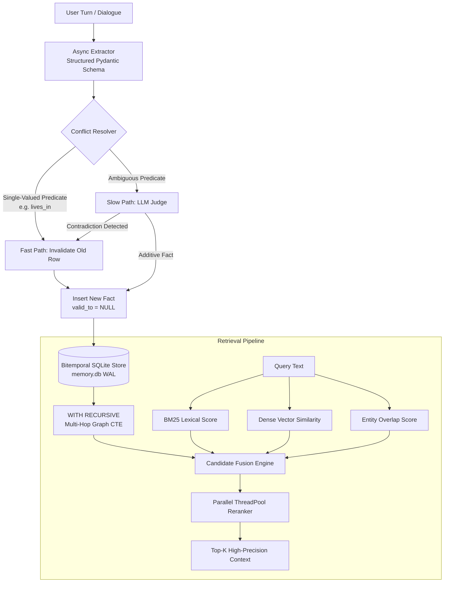

<p align="center">
  
</p>

<p align="center">
  <a href="https://github.com/Dilraj07/Memor/actions/workflows/ci.yml"></a>
  <a href="https://www.python.org/downloads/"></a>
  <a href="https://github.com/Dilraj07/Memor"></a>
</p>

---

**Memor** is an embedded, local-first bitemporal memory and retrieval engine for LLM agents.

Standard vector databases store static embeddings of chat chunks. Over time, as users change their location, job, or preferences, chunk-based retrieval suffers from temporal drift—returning stale or contradictory facts. Memor solves this by extracting structured Subject-Predicate-Object facts and storing them in a bitemporal SQLite engine that tracks exactly when every fact became true, when it was invalidated, and when it was recorded.

## Key Capabilities

- **Zero-Infrastructure Embedded Storage**: Runs entirely on a local SQLite file (`memory.db`) with Write-Ahead Logging (WAL). No vector database clusters or cloud services required.
- **Bitemporal Fact Audit Log**: Tracks both world time (`valid_from` to `valid_to`) and system transaction time (`recorded_at`). Previous states are never silently overwritten.
- **Dual-Path Contradiction Resolution**: Fast-path heuristics instantly update single-valued predicates (e.g., `lives_in`, `works_at`). Ambiguous updates route through an LLM judge to determine whether new facts replace or append to existing knowledge.
- **Hybrid Retrieval Pipeline**: Combines BM25 lexical search, dense semantic embeddings (`sentence-transformers`), and entity overlap scoring.
- **Recursive Multi-Hop Graph Traversal**: Automatically traverses relationship chains (e.g., `user -> brother -> Alex -> owns_pet -> dog`) using SQLite `WITH RECURSIVE` common table expressions (CTEs) without requiring an external graph database.
- **Parallel LLM Reranking**: Reranks top candidates concurrently across thread pools for sub-second relevance refinement.
- **Bounded Garbage Collection**: Includes explicit, batch-based pruning (`engine.prune(older_than_days=N)`) that safely archives expired records to an immutable `facts_archive` table before deletion.
- **Strict Multi-Tenancy & Thread Safety**: All operations are strictly isolated by `user_id` and protected by thread locks and backpressure queues.

---

## Architecture Flow



---

## Installation

The easiest way to install Memor is directly from PyPI:

```bash
pip install memor-db
```

To install it with the Model Context Protocol (MCP) server for AI agents:
```bash
pip install memor-db[mcp]
```

### From Source (Development)
If you want to modify the source code, you can clone the repository and install it locally:

```bash
git clone https://github.com/Dilraj07/Memor.git
cd Memor
pip install -e .
```

Set your API provider credentials in `.env` or as an environment variable:

```bash
export GROQ_API_KEY="gsk_your_api_key_here"
```

---

## Quickstart

```python
import time
from memor.engine import MemoryEngine

# Initialize the embedded memory engine
engine = MemoryEngine()
user_id = "tenant_8842"

# 1. Add dialogue asynchronously (zero latency overhead on chat loops)
engine.add_memory(user_id, "I live in San Francisco and work as a kernel developer.")
engine.add_memory(user_id, "My brother Alex recently adopted a golden retriever.")

# 2. Add an update that supersedes a previous state
engine.add_memory(user_id, "I just relocated to Seattle last weekend.")

# 3. Flush pending background extraction queues before synchronous queries
engine.flush(user_id)

# 4. Retrieve precise context (automatically combines active facts & multi-hop chains)
context = engine.query(user_id, "Where does the user live and what pet does their family own?", k=3)
print(context)
```

**Output:**
```text
- user lives in Seattle (Relevance: 9.50)
- user -> brother -> Alex -> adopted -> golden retriever (Relevance: 9.10)
- user works as kernel developer (Relevance: 7.20)
```

---

## How Bitemporal State Tracking Works

When a user's state changes, overwriting the record destroys temporal context. Memor instead updates the previous fact's `valid_to` timestamp and inserts the new state:

| `id` | `user_id` | `subject` | `predicate` | `object` | `valid_from` | `valid_to` | `status` |
|---|---|---|---|---|---|---|---|
| 101 | `tenant_8842` | `user` | `lives_in` | `San Francisco` | `2026-01-10T10:00:00Z` | `2026-07-11T14:30:00Z` | *Superceded* |
| 102 | `tenant_8842` | `user` | `lives_in` | `Seattle` | `2026-07-11T14:30:00Z` | `NULL` | **Active** |

Retrieval queries filter by `WHERE valid_to IS NULL` by default, ensuring immediate access to current truths while preserving the full historical timeline for auditing or time-travel queries.

---

## API Reference

### `MemoryEngine`

#### `add_memory(user_id: str, text: str, sync: bool = False) -> None`
Submits natural language text for background fact extraction and bitemporal resolution.
- `sync=False`: Non-blocking submission to the internal worker pool. Applies backpressure if queue depth exceeds 100 turns.
- `sync=True`: Synchronous extraction and persistence.

#### `flush(user_id: str) -> None`
Blocks execution until all pending asynchronous extraction futures for `user_id` complete. Recommended before reading immediate read-after-write state.

#### `query(user_id: str, query_text: str, k: int = 5) -> str`
Runs multi-signal hybrid retrieval (lexical + dense embedding + graph traversal) and returns the top `k` reranked factual statements formatted for LLM prompt injection.

#### `prune(older_than_days: int) -> int`
Garbage collection utility. Moves invalidated records older than `older_than_days` into `facts_archive` and hard-deletes them from the active index in bounded transactional batches of 500.

#### `shutdown() -> None`
Gracefully terminates background thread pools and executor queues.

---

## Model Context Protocol (MCP) Server

Memor includes a native Model Context Protocol (`mcp`) `stdio` server, allowing autonomous AI agents (like Claude for Desktop) to directly interface with your memory database without custom integration code.

**1. Install with MCP dependencies:**
```bash
pip install memor-db[mcp]
```

**2. Configure your AI Agent:**
Add `memor-server` to your MCP client configuration (e.g., `claude_desktop_config.json`):
```json
{
  "mcpServers": {
    "memor": {
      "command": "memor-server",
      "args": []
    }
  }
}
```

**Available MCP Tools:**
- `add_memory(user_id, text)`: Extract and resolve contradictions automatically.
- `query_memory(user_id, text, limit)`: Fetch the most relevant context.
- `get_user_profile(user_id)`: Retrieve the complete set of active facts for prompt injection.
- `forget_memory(user_id)`: GDPR-compliant hard delete of all user facts.

---

## Testing & Verification

Run the internal automated test suite across extraction, bitemporal pruning, and retrieval benchmarks:

```bash
pip install -e ".[dev]"
pytest tests/ -v
```

### Pytest Benchmark Plugin
Memor ships with a registered `pytest11` plugin (`pytest-temporal-memory`). You can use Memor's rigorous contradiction test suite to evaluate **any** third-party memory database by simply inheriting from our benchmark class:

```python
# test_my_custom_db.py
from memor.testing.plugin import BaseTemporalMemoryBenchmark
from memor.testing.adapter import MemoryBackendAdapter

class MyAdapter(MemoryBackendAdapter):
    def add_memory(self, user_id: str, text: str): ...
    def query(self, user_id: str, query_text: str, limit: int) -> str: ...
    def clear(self, user_id: str) -> None: ...

class TestMyCustomDB(BaseTemporalMemoryBenchmark):
    def get_adapter(self):
        return MyAdapter()
```
Run `pytest test_my_custom_db.py` to see how your backend handles temporal drift!
